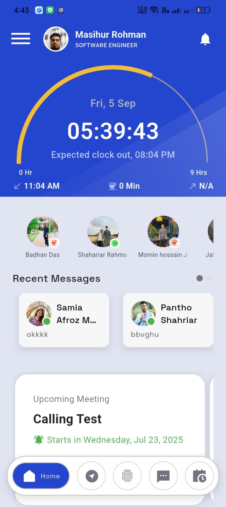
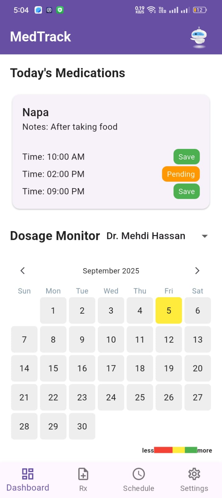
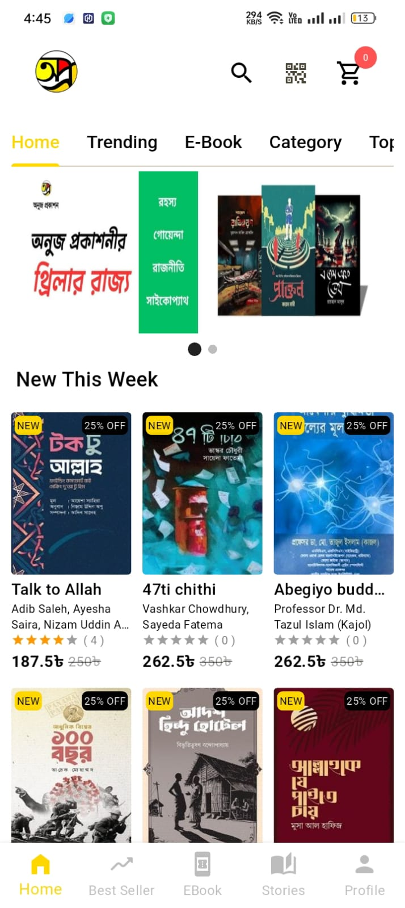
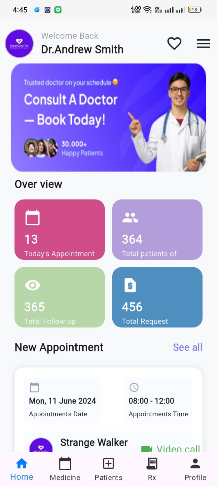

<table>
<tr>
<td width="240" align="center" valign="middle">
  
</td>
<td>
  <h1>👋 Hi, I'm Masihur Rohman</h1>
  <h3>Senior Mobile App Developer | Flutter & Cross-Platform Specialist</h3>
  

    🔭 Leading development on <a href="https://play.google.com/store/apps/details?id=net.attendancekeeper.app&hl=en">Attendance keeper</a> 
    🌱 Expertise: Flutter, Dart, Firebase, Clean Architecture, REST/GraphQL APIs 
    🛠️ Experienced in CI/CD, performance optimization, and scalable backend integration 
    📫 Reach me: <strong>masihur96@gmail.com</strong> | 🌐 <a href="https://masihur.vercel.app/">Portfolio</a>
  

</td>
</tr>
</table>

---
### 📱 Featured Apps
<table align="center">
<tr>
  <td align="center">
    
  </td>
  <td align="center">
    
  </td>
    <td align="center">
    
  </td>
  <td align="center">
    
  </td>
</tr>
</table>

---

### 🌍 Connect With Me

  
  
  
  
  

---

### 🛠️ Tech Stack

  

---

### 📊 GitHub Stats

  
  

  

---

### ☕ Support My Work

  
  

